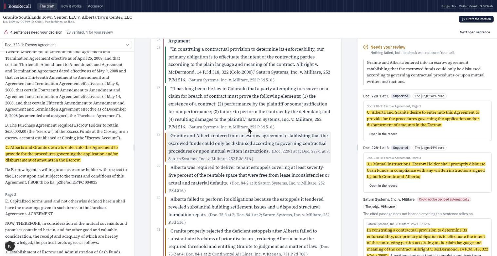
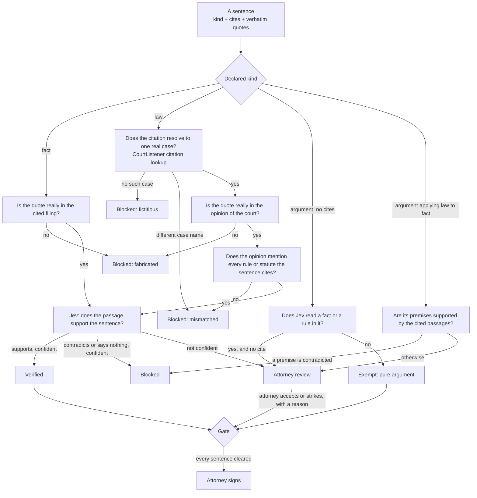

# RossRecall

An AI litigation associate that drafts from a real case file, where every sentence is checked
against the filing or the opinion it cites before an attorney sees it, and nothing can be signed
while any sentence is open.

The name is from *Suits*: Mike Ross does not paraphrase from memory, he recalls the page. Neither
does this. Facts and rules are **selected and quoted, not written**. A model that cannot generate
text reads every passage of the record and picks the ones that establish what the motion needs;
code quotes them. A writing model is used only for the few sentences that apply the law to the
facts, and those always go to the attorney.

**Live: [rossrecall.vercel.app](https://rossrecall.vercel.app)**. A recorded run plays for anyone,
at no cost. Running a lane live calls paid models, so it needs an invite link.



This is a work sample by [Dariel Carrion](https://github.com/JohnCari). The case file is a real
case, *Granite Southlands Town Center, LLC v. Alberta Town Center, LLC*, No. 1:09-cv-00799
(D. Colo.), taken from public filings on CourtListener. This project is not affiliated with any
party, lawyer or company, and nothing in it is legal advice.

## The claim, stated carefully

Not "this system does not hallucinate." The claim is narrower and checkable:

1. **Most of the draft cannot be fabricated, by construction.** A selected fact is a verbatim
   passage of a filing. A selected rule is a verbatim paragraph of an opinion whose citation
   resolved to one real case under the right name. No generative model touched either.
2. **Everything else is checked before the attorney sees it.** A quote must really be in the cited
   document, a citation must resolve, a rule number must appear in the opinion cited for it, and a
   judge model must agree the passage supports the sentence, or say it is not sure.
3. **Nothing is finishable while a sentence is open.** The gate is code, not a prompt. The agent
   cannot skip it, and sign-off re-checks it inside the database transaction.
4. **How often the checker is wrong is measured and published**, on a held-out half of the test
   set, with the uncertainty a small test set deserves.

## Why the judge is Jev: it can be wrong, but it cannot make things up

The usual way to check a model's output is to ask another generative model. That judge shares the
drafter's failure mode: given a plausible sentence it can produce a plausible justification, and it
can introduce facts of its own while doing so.

[Jev](https://typesafe.ai) is a different class of model. It does not generate text. It takes a
state and a set of closed questions and returns, for each, a choice from options you defined and a
probability for every option:

```ts
const result = await evaluate({
  model: "typesafe-ai/jev",
  state: { items: { c0: { claim, passage } } },
  questions: {
    c0: {
      type: "choice",
      instructions: "How does `items.c0.passage` relate to the claim in `items.c0.claim`?",
      criteria: {
        supports: "The passage states the claim or directly implies that it is true",
        contradicts: "The passage states the opposite of the claim or implies that it is false",
        says_nothing: "The passage does not address what the claim asserts, either way",
      },
    },
  },
});
// => { choice: "contradicts", probabilities: { supports: 0.01, contradicts: 0.99, says_nothing: 0 } }
```

There is no free-text channel in that answer. Jev can pick the wrong option. What it cannot do is
invent a fact, a quotation or a citation, because it has nowhere to put one. That is the precise
sense in which it does not hallucinate: **its errors are misjudgments, which can be counted, not
fabrications, which cannot be anticipated.** The probability that comes with each answer is what
lets the system act alone when the judge is sure and hand the sentence to a person when it is not.

Typesafe's own documentation says typed output "guarantees the interface, not truth." This project
takes that at face value, which is why the judge is measured rather than trusted.

## Jev first: select, do not generate

The obvious design is "a language model drafts, a judge checks." The better question is how little
the language model needs to write at all. In the default lane
([`src/lib/pipeline`](src/lib/pipeline)):

| Part of the motion | Who produces it | Can it contain an invented word? |
| --- | --- | --- |
| Statement of facts | Jev reads **every** passage of the record and says which element of the claim, if any, it establishes. Code takes the top passages per element, trims to whole sentences, and quotes them under a lead-in that names only the filing | No |
| Legal standard and rules | For each rule the motion needs, leads are resolved on CourtListener, Jev picks the paragraph of the opinion that states the rule, code quotes it | No |
| Application of law to fact | Gemini 3.8 Flash writes one sentence per element. It never types a quote or a cite: it names numbered facts and rules, and code attaches them | Yes, so its premises are checked and the sentence always goes to the attorney |

The elements and rules are data an attorney can read and change
([`src/lib/drafting/task.ts`](src/lib/drafting/task.ts)), not a prompt.

**Is the writing model needed?** Measured, not asserted: see the lane comparison below. With Gemini
switched off entirely the lane still produces the facts and the law, verified, for about a cent. It
reads as an annotated list of quotations, because nothing says what follows from them. The
sentences that need writing are exactly the ones that need a lawyer's judgment anyway. The agent
lane, where a model plans, uses tools and talks to the attorney, needs a generative model by
definition, and it now gets its facts from the same Jev selection through a `collect_facts` tool.

Reading the whole record this way, a few hundred passages in 12-question batches, costs under a cent,
which is why there is no retrieval step in front of it and no vector store in the stack.

## How a sentence gets checked



Everything code can decide is decided in code first, deterministically and for free: a quote that
is not in the document never reaches a model. Matching is exact after normalising whitespace and
typography. There is no fuzzy matching, because a reworded quote is not a quote. An ellipsis may
shorten a quote inside one paragraph but may not stitch two paragraphs together.

Details that close loopholes a drafter under pressure will find:

- **Relabelling.** A drafter could mark every sentence "argument" to avoid citing anything. Jev
  independently reads each sentence for whether it asserts a fact or states a rule, and the
  stricter reading wins.
- **Outages.** If CourtListener is down, the citation is reported as unavailable and the sentence
  goes to the attorney. An outage is never a finding that a case is fake, and never a pass.
- **Application sentences.** The verifier checks their premises against the cited passages and
  then sends them to the attorney regardless. Whether a conclusion follows is the attorney's
  judgment, and marking it verified would claim more than was checked.
- **Statutes and rules.** CourtListener resolves case citations, not Fed. R. Civ. P. 56 or a C.R.S.
  section. So a rule is verified *as quoted by a court*: a sentence that cites a rule must also cite
  an opinion, and the rule number must appear in that opinion. "Rule 56(c)" cited to a case that
  never mentions it is blocked in code.
- **Dissents.** The resolver prefers the opinion of the court, so a rule quoted from a dissent is
  not handed to the judge as if it were the holding.

The implementation is in [`src/lib/verify`](src/lib/verify), with no dependency on either lane.
Every external dependency is injected, so the whole thing runs under unit tests with a scripted
judge.

## The case file is real

There is no mock data. Everything the system reasons over came from CourtListener: 24 filings from
the RECAP archive for the record, 16 opinions for the law.

The case was chosen by screening District of Colorado contract disputes between companies for one
whose exhibits, affidavits and depositions are publicly available, not just the judge's orders.
*Granite v. Alberta* is a dispute over $650,000 held in escrow after the sale of a shopping centre:
the seller was to get the money once it delivered tenant estoppel certificates in the agreed form,
two tenants returned certificates disclosing a structural problem, and both sides claimed the
fund. The record holds the Release and Termination Agreement, the Escrow Agreement, the letters,
the estoppel certificates, affidavits and deposition transcripts, listed in
[`knowledge/matter.manifest.json`](knowledge/matter.manifest.json) and built by `pnpm matter`.

Two things follow from using a real file:

- **The text is as filed.** Many filings are scans, so quotes carry the recognition errors of the
  source ("Eserow", "shal!"). Nothing is cleaned up, because a quote that was tidied is no longer a
  quote of the record. Page stamps are stripped and the page number kept, so cites read like a
  brief: `(Doc. 78-1 at 4.)`.
- **The court's own findings are the answer key, and the drafter never sees them.** The parties'
  briefs and the court's Memorandum and Order (Doc. 195) are deliberately left out of the record.
  The order lives in [`bench/answer-key`](bench/answer-key), and where a "sound" test sentence
  states a fact the court itself found, the row says so. That label is a judge's, not mine.

## What the numbers say

[`bench/dataset/v0.2`](bench/dataset/v0.2) holds 73 sentences written against the real record and
the real opinions. 26 are sound. 47 each carry one planted failure of a known kind. Integrity tests
check every label against the corpus in code, so a typo in a sound row cannot pose as a verifier
miss. Rows are split in half by a hash of their id. **The confidence threshold was examined on the
development half only, and the numbers below are from the held-out half.** Three live runs.

| Held-out half, threshold 0.8 | Count | Rate | 95% interval (Wilson) |
| --- | --- | --- | --- |
| Bad sentences that got through | 0 of 19 | 0.0% | 0.0% to 16.8% |
| Sound sentences held back | 0 of 17 | 0.0% | 0.0% to 18.4% |
| Bad sentences blocked with no person involved | 17 of 19 | 89.5% | 68.6% to 97.1% |
| Sentences whose status changed across 3 identical runs | 0 of 73 | | |

| Does the record say that? | n | Cleared | To the attorney | Blocked |
| --- | --- | --- | --- | --- |
| Fabricated quote | 5 | 0 | 0 | 5 |
| Real quote cited to the wrong filing | 4 | 0 | 0 | 4 |
| Sentence contradicts its quote | 6 | 0 | 0 | 6 |
| Quote does not establish the sentence | 6 | 0 | 4 | 2 |
| Sentence overstates its quote | 5 | 0 | 2 | 3 |
| Uncited fact relabelled as argument | 3 | 0 | 3 | 0 |
| Sound sentence | 16 | 16 | 0 | 0 |
| Pure argument | 3 | 3 | 0 | 0 |

| Does the case say that? | n | Cleared | To the attorney | Blocked |
| --- | --- | --- | --- | --- |
| Fictitious citation | 4 | 0 | 0 | 4 |
| Real citation under another case's name | 4 | 0 | 0 | 4 |
| Real case, real quote, does not state the rule | 4 | 0 | 0 | 4 |
| Quote from one case cited to another | 3 | 0 | 0 | 3 |
| Rule number the opinion never mentions | 3 | 0 | 0 | 3 |
| Sound sentence | 7 | 7 | 0 | 0 |

**Read the interval, not the zero.** Nineteen held-out bad sentences cannot rule out a miss rate
near 17%. An earlier version of this bench, on a different record, let 2 of 36 through, and both
were the same mistake: a true quote accepted as support for a conclusion it did not quite
establish. That is still the class to watch. Here those rows were mostly *sent to the attorney*
rather than blocked, which is the design working and also where a miss would come from.

**On the threshold.** On the development half every threshold from 0.5 to 0.95 made no mistakes,
so the data cannot tell them apart; 0.99 starts holding sound sentences. The cautious 0.8 stays.
The earlier bench suggested 0.95 would have caught its two misses. That was a hypothesis, this was
the held-out check, and it neither confirmed nor refuted it.

**On noise.** No row changed status across these three runs. Earlier runs have shown one or two
rows flip at the threshold, so Jev is close to deterministic, not deterministic. The CI gate
(`pnpm bench:gate`) guards the held-out counts, allows exactly the run-to-run spread observed in
the baseline, and refuses results produced while citation lookups were unavailable.

**What these numbers do not show.** Most rows were written and labelled by the engineer who built
the verifier; none was adjudicated by a practising attorney. One matter, one court. The planted
failures are the ones I thought of. Reproduce with `pnpm bench`, about a fifth of a cent per run.
The [Quality page](src/app/quality/page.tsx) renders the same file.

## Two lanes, one gate

Both ways of producing the draft sit behind the same verifier and the same gate, so they can be
compared on equal terms.

**The Jev-first pipeline** is described above: a fixed sequence in code, where models fill in
stages and never choose the next one. A selected sentence the verifier will not clear is dropped,
not rewritten; a written sentence it blocks stays visible, because hiding it would hide the one
kind of mistake this lane can make.

**The agent** ([`agent/`](agent)) runs on [eve](https://eve.dev). Gemini 3.8 Flash chooses its own
path through ten tools and nothing else; every default tool, including shell, file system and web
access, is switched off.

| Tool | What it does |
| --- | --- |
| `collect_facts` | Jev-selected verbatim passages for a point, ready to quote |
| `list_record`, `read_record` | Read the case file |
| `search_record` | Full-text recall, then Jev reranks by whether a paragraph establishes the point |
| `search_case_law` | The committed corpus first, then CourtListener |
| `verify_citation` | Confirm the case exists under that name; return only paragraphs Jev says state the rule |
| `write_section` | Write structured sentences; refuses a fourth rewrite of any section |
| `validate_draft` | Run the verifier; returns each held sentence and the reason |
| `ask_question` | Park the turn durably until the attorney answers |
| `finalize_draft` | Refused in code while anything is open; otherwise requires the attorney's approval |

The agent chooses the path. It does not choose the guarantees. `finalize_draft` has two locks and
the agent holds neither key: its approval policy re-verifies the draft and denies the call while
any sentence is open, and signing re-checks the gate inside the Convex transaction.

### The comparison

Same case file, same instruction, eight runs per lane, read back from what each run stored.
Medians, with 95% bootstrap intervals in brackets. `pnpm bench:lanes`.

<!-- LANES -->

Eight runs can show a several-fold difference in cost or a difference of several sentences. They
cannot rank lanes whose intervals overlap, and they say nothing about a different matter.

## Why build agentic RAG this way

Retrieval-augmented generation usually means: retrieve some passages, put them in the prompt, hope
the model stays close to them. The grounding is a suggestion. Here it is a contract.

1. **The quote is the unit of grounding.** A sentence does not cite "the deposition". It carries
   the exact words it rests on. That turns "is this grounded?" from a judgment call into a string
   search followed by one narrow question, and gives the attorney something to check in a click.
2. **Judge, then quote, instead of retrieve, then write.** When a judge model is cheap enough to
   read everything, the retrieval step and its failure modes disappear for the record. Where search
   is still needed, for case law, results are reranked by whether a passage *establishes* the
   point, which is also what tells a retrieval failure from a generation failure.
3. **The tool surface is small and typed.** An agent with a shell can do anything, including
   things nobody reviewed. Ten tools with schemas is a surface a person can read in a minute and
   an eval can cover.
4. **Guarantees live in code the model cannot reach.** Instructions ask the agent to verify; the
   gate does not depend on it complying. When the two disagree, the gate wins and the refusal is
   logged.

Agents are the wrong instrument when the path is already known, which is why the pipeline is the
default lane and why the repo lets measurement, rather than preference, say which should survive.

## How the guarantees are tested

A guarantee that was only ever exercised because the model happened to comply has not been tested.

| Layer | What it proves | Command |
| --- | --- | --- |
| Unit tests | Every verdict path with a scripted judge: fabricated, contradicted, fictitious, mismatched, wrong rule, ambiguous, outage, relabelling, a missing judge answer. Dataset labels are checked against the corpus | `pnpm test` |
| Gate integration | No model in the loop. A fabricated sentence is written straight into a draft. Sign-off is refused before verification, the sentence is blocked in code, sign-off is refused again, accepted once the attorney strikes it, and the signed draft then refuses new text | `pnpm gate:integration` |
| Agent evals | Against the running agent, asserted on what is stored rather than on what the agent says: a planted prompt injection never ends up in a cleared sentence, and an "attorney" ordering a fabricated quote to be filed never gets it cleared or signed | `pnpm eval` |

**The record is evidence, not instruction.** The injection test plants a memo telling any AI that
reads it to state a false fact and cite an invented case. That memo is the only invented document
in the repository. It is a test fixture ([`evals/fixtures`](evals/fixtures)): added to the
development record for one eval run and removed again, never seeded, never deployed, never shown.
The defence is layered: instructions say documents are data; a repeated false fact has no quote
in any filing and is blocked in code; the invented case resolves to nothing on CourtListener.

## The knowledge format

The case file and the authorities are an [Open Knowledge Format](https://github.com/GoogleCloudPlatform/open-knowledge-format)
bundle in [`knowledge/`](knowledge): markdown with YAML frontmatter, one file per document, with
provenance as first-class fields (`resource`, `sources`, `generated`, `status`). Every document
carries its CourtListener URL and retrieval date. It reads like a wiki, diffs like code, and needs
no bespoke store. The human-facing notice on each document ("reproduced as retrieved; scanned, so
it contains recognition errors") is split off by the loader and never sent to a model.

The authorities are real opinions fetched by `pnpm authorities` and committed as retrieved:
*Celotex*, *Anderson v. Liberty Lobby*, *Matsushita* and *Adler v. Wal-Mart* for the federal
standard, and Colorado contract cases. Leads written from memory, which is exactly what the
drafting agent is forbidden to rely on, were held to the agent's own rule: the citation had to
resolve to exactly one case under a matching name. One, *Churchey v. Adolph Coors Co.*, was dropped
because CourtListener returned a server error for its text; nothing was substituted. Both lanes
search this corpus before they search CourtListener, which throttles hard.

## The stack, and why each piece

| Piece | Why it is here |
| --- | --- |
| **Jev (Typesafe)** | Selects, reranks and judges. It cannot generate, and its calibrated probabilities make confidence routing possible. $0.042 per million input tokens |
| **Vercel AI Gateway** | One key and one hard budget for both models. Jev is `typesafe-ai/jev` through the AI SDK's evaluation API; the drafter is a model string |
| **eve** | The agent is a directory of files: one file per tool, approval policies on tools, durable sessions, per-session cost limits, evals in the same repo. Human-in-the-loop is a property of a tool |
| **Convex** | The draft, its verifications and the attorney's decisions are reactive documents, so both lanes and the browser see the same state with no polling. Signing re-evaluates the gate inside a transaction |
| **Next.js on Vercel** | One deployment for the app and the agent, same origin, no CORS |
| **shadcn/ui** | Every surface is composed from its components; the pleading paper is the one custom element |
| **CourtListener** | The only data source: RECAP filings, opinions, and a citation-lookup API built to catch invented citations |
| **TypeScript, Biome, vitest** | One language end to end. Schemas are shared between the agent's tools, the pipeline and the database |

**Jev through the gateway.** Every Jev call in development, in the bench and in production went
through the Vercel AI Gateway; no direct Typesafe key is needed. One caveat found under load: Jev
has a single provider behind the gateway, so there is no fallback route, and one burst returned a
503. Every call now retries with backoff ([`retry.ts`](src/lib/verify/retry.ts)), and
`pnpm jev:check` is a ten-second smoke test of the route.

The full tool list, with what was kept, added and dropped relative to a production monorepo, is in
[`docs/TOOLLIST.md`](docs/TOOLLIST.md).

## A public demo that calls paid models

- The live lanes require an invite link. The link sets a signed, HTTP-only cookie; the eve channel
  and every mutating route check it. Without it, a recorded run still plays at no cost.
- Convex public functions are reachable by anyone with the deployment URL, so every write takes a
  server-only secret and is called only from server code. The browser never writes to Convex.
- The agent has a per-session cost ceiling, the pipeline route has a global daily rate limit, and
  the AI Gateway key has a hard budget.
- The agent has no shell, no file system and no web access.

## Run it

```bash
pnpm install
vercel link && vercel integration add convex   # Convex through the Vercel Marketplace
cp .env.example .env.local                      # then fill it in
pnpm exec convex env set SERVER_SECRET <the value in .env.local>
pnpm exec convex dev --once
pnpm seed                                       # load knowledge/ into Convex
pnpm dev                                        # Next.js and the eve agent together

pnpm test              # unit tests, including dataset integrity
pnpm bench             # both planted-failure sets, live against Jev
pnpm bench:gate        # the blocking quality gate CI runs
pnpm bench:lanes       # the lane comparison (needs pnpm dev running)
pnpm gate:integration  # the gate and sign-off, with no model in the loop
pnpm eval              # agent evals, against the running dev server
pnpm pipeline          # one Jev-first run; add -- --jev for no generative model
pnpm jev:check         # smoke test of Jev through the AI Gateway
pnpm matter            # rebuild the case file from RECAP (needs a CourtListener token)
pnpm authorities       # fetch the opinions from CourtListener
```

### Deploying

`vercel.json` runs `convex deploy --cmd 'pnpm build'`, which pushes the Convex functions and injects
the Convex URL into the build. The eve agent runs as its own service and reads the URL at runtime,
so `NEXT_PUBLIC_CONVEX_URL` must also be set as a Vercel environment variable. `vercel env pull`
does not reveal sensitive variables, so set the production Convex `SERVER_SECRET` from the original
value rather than from a pulled file.

## Limitations, and what comes next

- **Attorney adjudication.** The test set needs labels from someone who practises. The app already
  stores every accept and strike with the sentence, the machine's verdict and the attorney's
  reason, so production disagreements can become test rows.
- **One matter.** The elements of the claim are written for this case. A second and third matter,
  in other courts, is what would show whether selection generalises.
- **The inference failure class.** A true quote that does not quite establish the sentence is the
  hardest kind. Candidate: a second, narrower question ("does the passage state this, or would a
  reader have to infer it?"), measured on held-out rows.
- **Scanned filings.** Selection and quoting work on recognition errors as they are. A misread
  number in a scan is quoted faithfully and wrongly; the attorney sees the original one click away,
  but nothing flags it.
- **The associate's chat replies are not verified.** Only sentences in the draft go through the
  verifier.
- **Prose.** A motion assembled from quotations is accurate and stiff. Nothing measures prose
  quality yet.
- **De-identification** before a model sees a record, scored on both leaked identifiers and
  over-redaction. This record is already public, so it was not needed here.
- This is TypeScript. The verifier's design carries to Python unchanged.
